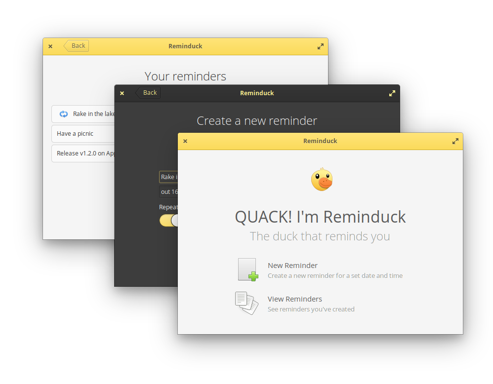

# Reminduck

<p align="center">
    <a href="https://appcenter.elementary.io/com.github.matfantinel.reminduck" target="_blank">
        
    </a>
    <a href='https://flathub.org/apps/details/com.github.matfantinel.reminduck' target="_blank"></a>
</p>

<p align="center">
  <a href="https://github.com/matfantinel/reminduck/blob/master/COPYING">
    
  </a>
  <a href="https://travis-ci.org/calo001/fondo">
    
  </a>
</p>

<p align="center">
    
</p>

Reminduck is a simple reminder app made to be quick and easy - it focuses on simple or recurrent reminders with set time and date and nothing else.

It's perfect if all you want are simple or daily/weekly/monthly reminders. Anything more than that is not achievable by Reminduck right now - but you can help! Open an issue or a pull request if you have any ideas or requests.

_And it quacks._

## Built for elementary OS

While Reminduck can run in any Linux distribution, it was built with [elementary OS] in mind. It runs perfectly on other distributions like Ubuntu, Fedora, etc. though. Download it on Flathub if you want to use Reminduck everywhere!

## Translating

You can help translating this app with the following steps:

* Add the language you want to translate to in the `po/LINGUAS` file (if it's already there, you can skip this step);
* Then, make sure the translation files are updated:
```shell
cd build
ninja com.github.matfantinel.reminduck-pot
ninja com.github.matfantinel.reminduck-update-po
```
* Then, update your language file in `po` folder with your translations. For example, portuguese (pt) translation file is `po/pt.po`;
* Fork this repo, commit to your repo and then open a Pull Request to this one.

## Developing and building

If you want to go ahead and compile Reminduck yourself, you'll need the following dependencies:

* libgranite-dev
* libgtk-3-dev
* meson
* valac
* libsqlite3-dev
* gettext

You can install them on elementary OS Juno with:

```shell
sudo apt install elementary-sdk libsqlite3-dev
```

And on other Ubuntu-based distributions with:

```shell
sudo apt install libgranite-dev libgtk-3-dev meson valac libsqlite3-dev gettext
```

Run `meson build` to configure the build environment and run `ninja install`
to install:

```shell
meson build --prefix=/usr
cd build
sudo ninja install
```

Then run it with:

```shell
com.github.matfantinel.reminduck
```

## Flatpak

Reminduck is also available as a Flatpak. To build/install it locally, first you have to install the necessary runtimes:

```shell
sudo apt install flatpak-builder
flatpak install flathub org.freedesktop.Sdk/x86_64/19.08
flatpak install flathub org.freedesktop.Platform/x86_64/19.08
flatpak install flathub io.elementary.BaseApp/x86_64/juno-19.08
```

Then, from the project root:

```shell
flatpak-builder --install repo com.github.matfantinel.reminduck.json --force-clean --user
```

The app should be displayed on your apps list, or you can run it with:
```shell
com.github.matfantinel.reminduck
```

[elementary OS]: https://elementary.io
