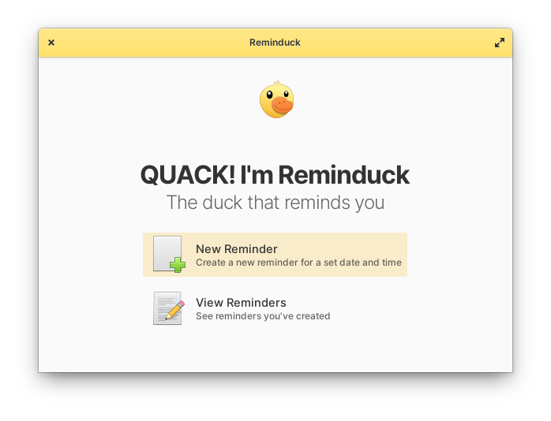

<p align="center">
    
</p>

# Reminduck

Reminduck is a simple reminder app made to be quick and easy - it focuses on simple reminders with set time and date and nothing else.

It does not aim to provide a complete control of your reminder needs (yet), but sometimes simple is just enough.

_And it quacks._

## Built for elementary OS

While Reminduck can run in any Linux distribution, it was built with [elementary OS] in mind. I appreciate any help packaging it for more distributions, though!

[][AppCenter]


## Developing and building

If you want to go ahead and compile Reminduck yourself, you'll need the following dependencies:

* libgranite-dev
* libgtk-3-dev
* meson
* valac

You can install them on elementary OS Juno with:

```shell
sudo apt install elementary-sdk
```

Run `meson build` to configure the build environment and run `ninja install`
to install:

```shell
meson build --prefix=/usr
cd build
sudo ninja install
```

Then run it with:

```shell
com.github.matfantinel.reminduck
```


**Made with :heart: on [elementary OS]**

[elementary OS]: https://elementary.io
[AppCenter]: https://appcenter.elementary.io/com.github.matfantinel.reminduck
